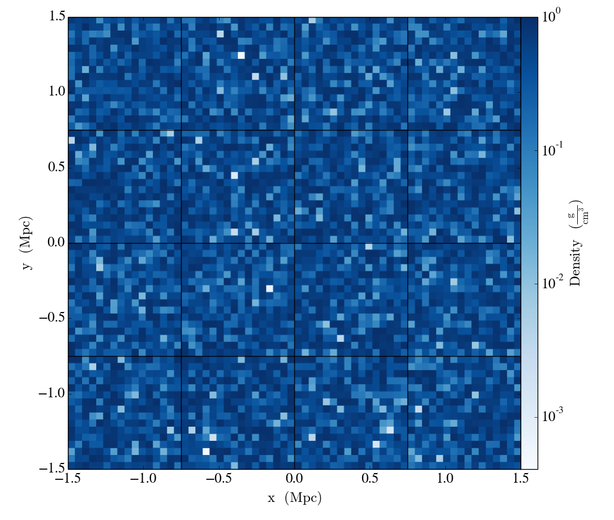
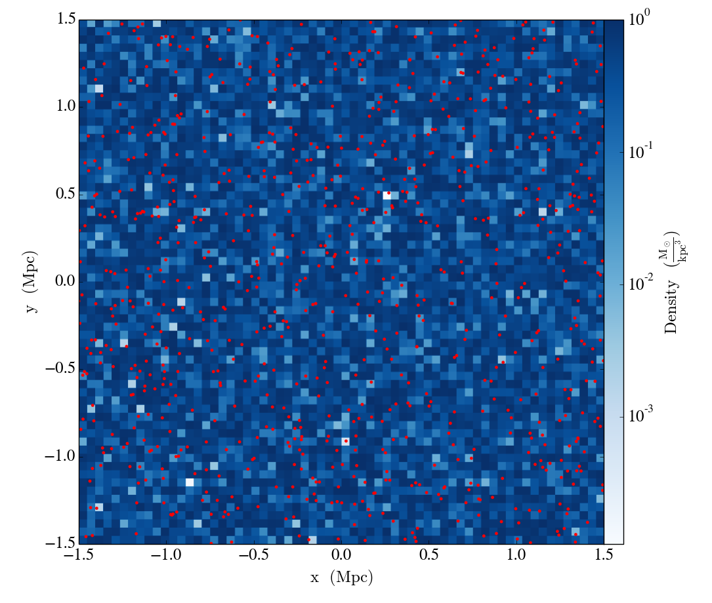
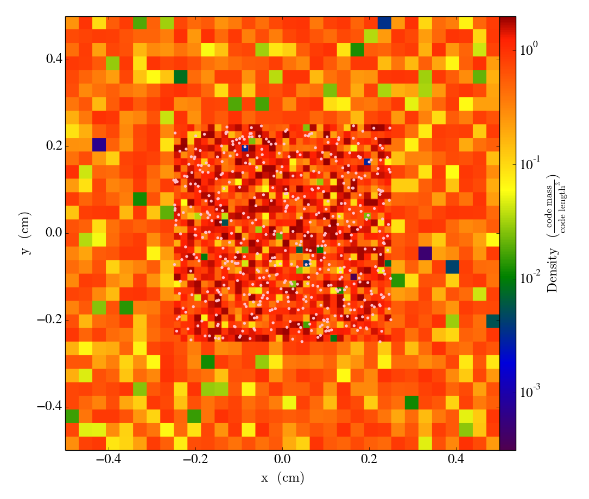
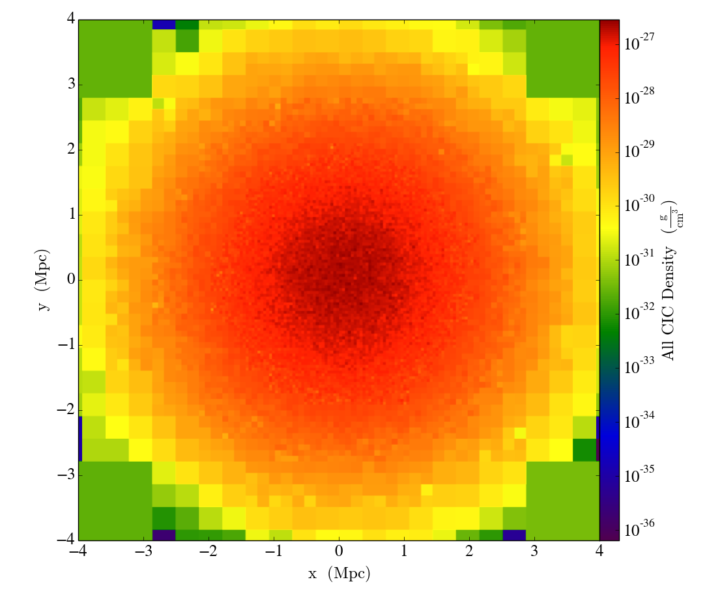

.. _in_memory_datasets:

.. |yt-docs| replace:: ``yt`` Documentation
.. _yt-docs: http://yt-project.org/docs/3.0

.. |generic_array_data| replace:: Loading Generic Array Data
.. _generic_array_data: http://yt-project.org/docs/3.0/examining/generic_array_data.html

.. |generic_particle_data| replace:: Loading Generic Particle Data
.. _generic_particle_data: http://yt-project.org/docs/3.0/examining/generic_particle_data.html

In-Memory Datasets
==================

This section shows how to load generic array (grid-based) and particle data that resides in
memory into ``jt`` to create ``Dataset`` objects.

.. note::

   This section is essentially a copy of the IPython notebooks |generic_array_data|_ and
   |generic_particle_data|_ from the |yt-docs|_. They have been reproduced here using Julia code
   to show how to generate generic ``Dataset``\ s for use with ``jt``.

Generic Unigrid Data
--------------------

The most common example on in-memory or "generic" data is that of data that is generated in memory
from the currently running script or notebook. In this example, we'll just create a 3-D array of
random floating-point data:

.. code:: jlcon

    arr = rand(64,64,64)

To load this data into ``jt``, we need to associate it with a field. The
data dictionary consists of one or more fields, each consisting of a
tuple of an ``Array`` and a unit string. Then, we can call
``load_uniform_grid``:

.. code:: jlcon

    data = Dict()
    data["density"] = (arr, "g/cm**3")
    bbox = [-1.5 1.5; -1.5 1.5; -1.5 1.5]
    ds = jt.load_uniform_grid(data, [64,64,64]; length_unit="Mpc", bbox=bbox, nprocs=64)

``load_uniform_grid`` takes the following arguments and optional
keywords:

-  ``data`` : This is a dict of numpy arrays, where the keys are the
   field names
-  ``domain_dimensions`` : The domain dimensions of the unigrid
-  ``length_unit`` : The unit that corresponds to ``code_length``, can
   be a string, tuple, or floating-point number
-  ``bbox`` : Size of computational domain in units of ``code_length``
-  ``nprocs`` : If greater than 1, will create this number of subarrays
   out of data
-  ``sim_time`` : The simulation time in seconds
-  ``mass_unit`` : The unit that corresponds to ``code_mass``, can be a
   string, tuple, or floating-point number
-  ``time_unit`` : The unit that corresponds to ``code_time``, can be a
   string, tuple, or floating-point number
-  ``velocity_unit`` : The unit that corresponds to ``code_velocity``
-  ``magnetic_unit`` : The unit that corresponds to ``code_magnetic``,
   i.e. the internal units used to represent magnetic field strengths.
-  ``periodicity`` : A tuple of booleans that determines whether the
   data will be treated as periodic along each axis

This example creates a yt-native dataset ``ds`` that will treat your
array as a density field in cubic domain of 3 Mpc edge size and
simultaneously divide the domain into ``nprocs`` = 64 chunks, so that
you can take advantage of the underlying parallelism.

The optional unit keyword arguments allow for the default units of the
dataset to be set. They can be:

  * A string, e.g. ``length_unit="Mpc"``
  * A tuple, e.g. ``mass_unit=(1.0e14, "Msun")``
  * A floating-point value, e.g. ``time_unit=3.1557e13``

In the latter case, the unit is assumed to be cgs.

The resulting ``ds`` functions exactly like a dataset like any other
``jt`` can handle--it can be sliced, and we can show the grid
boundaries:

.. code:: jlcon

    slc = jt.SlicePlot(ds, "z", ["density"])
    slc.set_cmap("density", "Blues")
    slc.annotate_grids(cmap=nothing)
    jt.show_plot(slc)

Particle fields are detected as one-dimensional fields. The number of
particles is set by the ``number_of_particles`` key in ``data``.
Particle fields are then added as one-dimensional ``Array``\ s in a similar
manner as the three-dimensional grid fields:

.. code:: jlcon

    arr = rand(64,64,64)
    posx_arr = 3*rand(10000)-1.5
    posy_arr = 3*rand(10000)-1.5
    posz_arr = 3*rand(10000)-1.5
    data = Dict()
    data["density"] = (arr, "Msun/kpc**3")
    data["number_of_particles"] = 10000
    data["particle_position_x"] = (posx_arr, "code_length")
    data["particle_position_y"] = (posy_arr, "code_length")
    data["particle_position_z"] = (posz_arr, "code_length")
    bbox = [-1.5 1.5; -1.5 1.5; -1.5 1.5]
    lu = (1.0,"Mpc")
    mu = (1.0,"Msun")
    ds = jt.load_uniform_grid(data, [64,64,64]; length_unit=lu, mass_unit=mu, bbox=bbox, nprocs=4)

In this example only the particle position fields have been assigned.
``number_of_particles`` must be the same size as the particle arrays. If
no particle arrays are supplied then ``number_of_particles`` is assumed
to be zero. Take a slice, and overlay particle positions:

.. code:: jlcon

    slc = jt.SlicePlot(ds, "z", ["density"])
    slc.set_cmap("density", "Blues")
    slc.annotate_particles(0.25, p_size=12.0, col="Red")
    jt.show_plot(slc)

Generic AMR Data
----------------

In a similar fashion to unigrid data, data gridded into rectangular
patches at varying levels of resolution may also be loaded into ``jt``.
In this case, a list of grid dictionaries should be provided, with the
requisite information about each grid's properties. This example sets up
two grids: a top-level grid (``level == 0``) covering the entire domain
and a subgrid at ``level == 1``.

.. code:: jlcon

    grid_data = [
        ["left_edge"=>[0.0, 0.0, 0.0],
         "right_edge"=>[1.0, 1.0, 1.0],
         "level"=>0,
         "dimensions"=>[32, 32, 32]],
        ["left_edge"=>[0.25, 0.25, 0.25],
         "right_edge"=>[0.75, 0.75, 0.75],
         "level"=>1,
         "dimensions"=>[32, 32, 32]]
       ]

We'll just fill each grid with random density data, with a scaling with
the grid refinement level.

.. code:: jlcon

    for g in grid_data
        g["density"] = rand(g["dimensions"]...) * 2^g["level"]
    end

Particle fields are supported by adding 1-dimensional arrays to each
``grid`` and setting the ``number_of_particles`` key in each ``grid``'s
dict. If a grid has no particles, set ``number_of_particles = 0``, but
the particle fields still have to be defined since they are defined
elsewhere; set them to empty ``Float64 Array``\ s:

.. code:: jlcon

    grid_data[1]["number_of_particles"] = 0 # Set no particles in the top-level grid
    grid_data[1]["particle_position_x"] = Float64[] # No particles, so set empty arrays
    grid_data[1]["particle_position_y"] = Float64[]
    grid_data[1]["particle_position_z"] = Float64[]
    grid_data[2]["number_of_particles"] = 1000
    grid_data[2]["particle_position_x"] = 0.5*rand(1000)+0.25
    grid_data[2]["particle_position_y"] = 0.5*rand(1000)+0.25
    grid_data[2]["particle_position_z"] = 0.5*rand(1000)+0.25

We need to specify the field units in a ``field_units`` ``Dict``:

.. code:: jlcon

    field_units = ["density"=>"code_mass/code_length**3",
                   "particle_position_x"=>"code_length",
                   "particle_position_y"=>"code_length",
                   "particle_position_z"=>"code_length"]

Then, call ``load_amr_grids``:

.. code:: jlcon

    ds = jt.load_amr_grids(grid_data, [32, 32, 32]; field_units=field_units)

``load_amr_grids`` also takes the same keywords ``bbox`` and
``sim_time`` as ``load_uniform_grid``. We could have also specified the
length, time, velocity, and mass units in the same manner as before.
Let's take a slice:

.. code:: jlcon

    slc = jt.SlicePlot(ds, "z", ["density"])
    slc.annotate_particles(0.25, p_size=15.0, col="Pink")
    jt.show_plot(slc)

Caveats for Loading Generic Array Data
~~~~~~~~~~~~~~~~~~~~~~~~~~~~~~~~~~~~~~

-  Particles may be difficult to integrate.
-  Data must already reside in memory before loading it in to ``jt``,
   whether it is generated at runtime or loaded from disk.
-  No consistency checks are performed on the hierarchy
-  Consistency between particle positions and grids is not checked;
   ``load_amr_grids`` assumes that particle positions associated with
   one grid are not bounded within another grid at a higher level, so
   this must be ensured by the user prior to loading the grid data.

Generic Particle Data
---------------------

This example creates a fake in-memory particle dataset and then loads it
as a ``jt`` dataset using the ``load_particles`` function.

Our "fake" dataset will be ``Array``\ s filled with normally distributed
random particle positions and uniform particle masses. Since real data
is often scaled, we arbitrarily multiply by 1e6 to show how to deal with
scaled data.

The ``load_particles`` function accepts a dictionary populated with
particle data fields loaded in memory as ``Array``\ s:

.. code:: jlcon

    n_particles = 5000000
    data = Dict()
    data["particle_position_x"] = 1.0e6*randn(n_particles)
    data["particle_position_y"] = 1.0e6*randn(n_particles)
    data["particle_position_z"] = 1.0e6*randn(n_particles)
    data["particle_mass"] = ones(n_particles)

To hook up with ``yt``'s internal field system, the dictionary keys must
be ``'particle_position_x'``, ``'particle_position_y'``,
``'particle_position_z'``, and ``'particle_mass'``, as well as any other
particle field provided by one of the particle frontends.

The ``load_particles`` function transforms the ``data`` dictionary into
an in-memory ``jt`` ``Dataset`` object, providing an interface for
further analysis with ``jt``. The example below illustrates how to load
the data dictionary we created above.

.. code:: jlcon

    bbox = 1.1*[minimum(data["particle_position_x"]) maximum(data["particle_position_x"]);
        minimum(data["particle_position_y"]) maximum(data["particle_position_y"]);
        minimum(data["particle_position_z"]) maximum(data["particle_position_z"])]

    ds = jt.load_particles(data, length_unit="pc", mass_unit=(1e8, "Msun"), n_ref=256, bbox=bbox)

The ``length_unit`` and ``mass_unit`` are the conversion from the units
used in the ``data`` dictionary to CGS. I've arbitrarily chosen one
parsec and :math:`10^8 M_\odot` for this example.

The ``n_ref`` parameter controls how many particle it takes to
accumulate in an oct-tree cell to trigger refinement. Larger ``n_ref``
will decrease poisson noise at the cost of resolution in the octree.

Finally, the ``bbox`` parameter is a bounding box in the units of the
dataset that contains all of the particles. This is used to set the size
of the base octree block.

This new dataset acts like any other ``jt`` ``Dataset`` object, and can
be used to create data objects and query for ``jt`` fields. This example
shows how to access "deposit" fields:

.. code:: jlcon

    ad = jt.AllData(ds)
    cic_density = ad["deposit", "all_cic"]
    nn_density = ad["deposit", "all_density"]
    nn_deposited_mass = ad["deposit", "all_mass"]
    particle_count_per_cell = ad["deposit", "all_count"]

Finally, we'll slice through the ``"all_cic"`` deposited particle field:

.. code:: jlcon

    slc = jt.SlicePlot(ds, 2, ("deposit", "all_cic"))
    slc.set_width((8, "Mpc"))
    jt.show_plot(slc)

