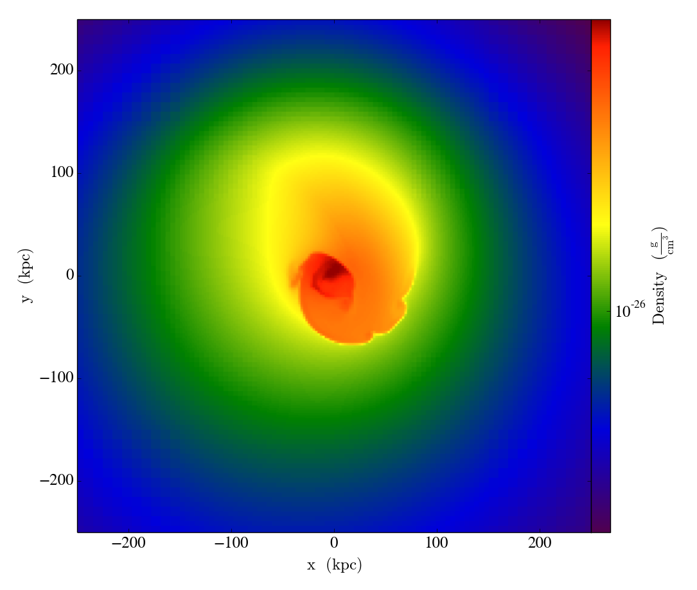
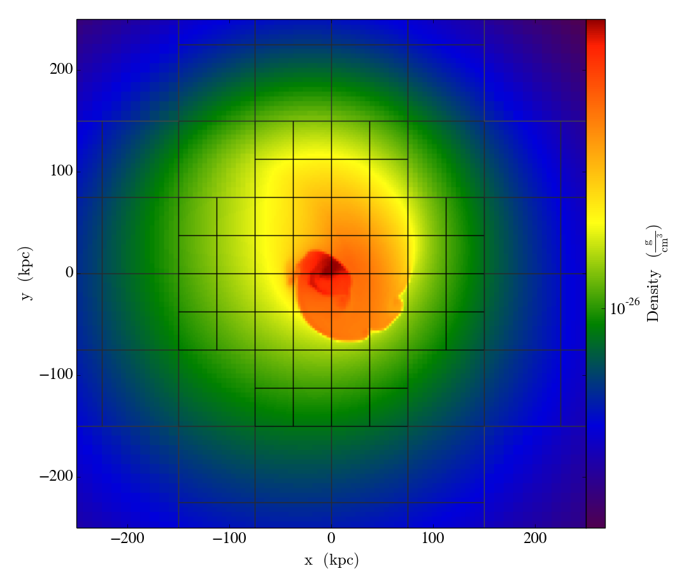
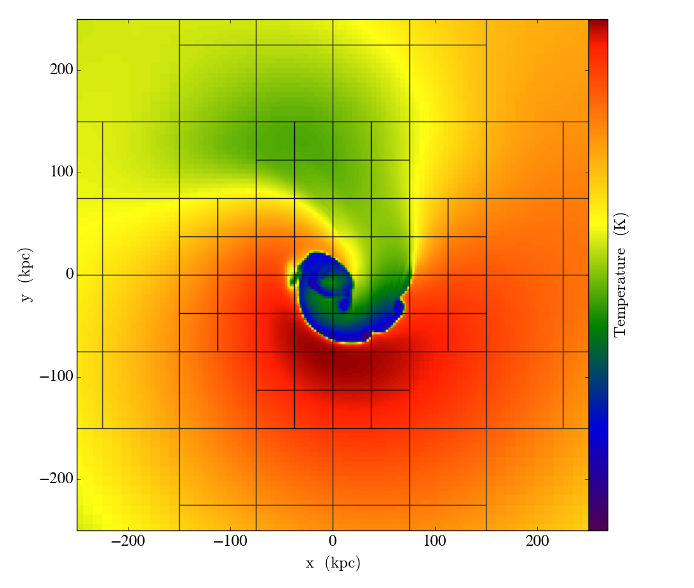
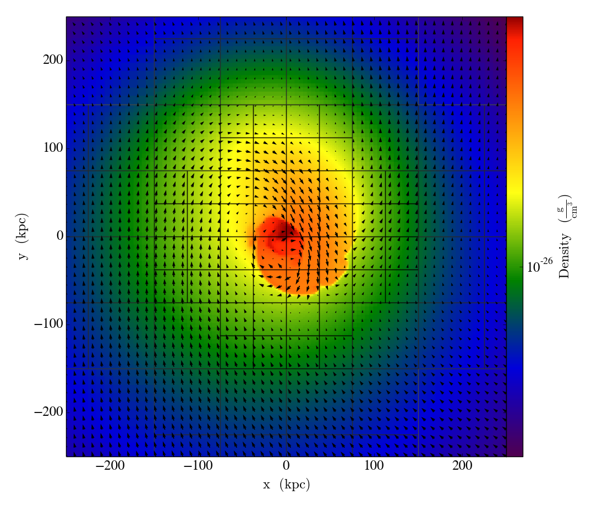
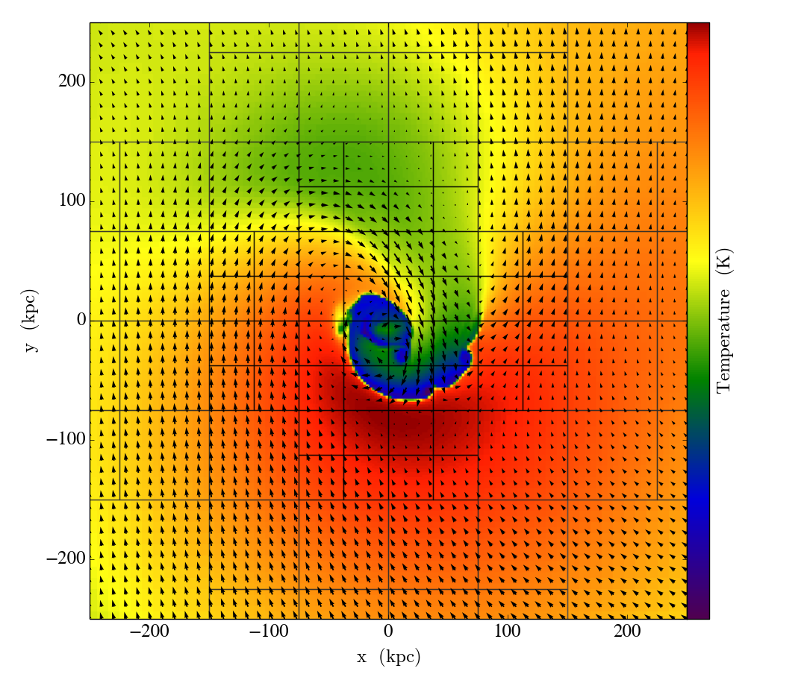
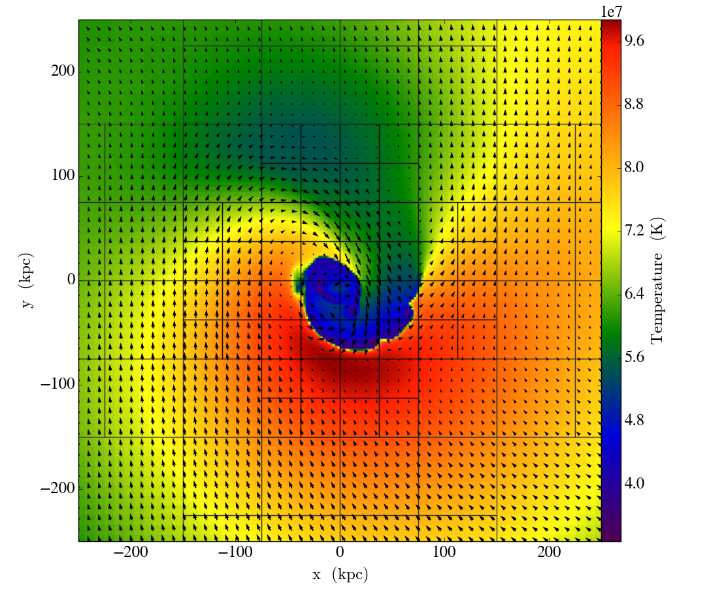
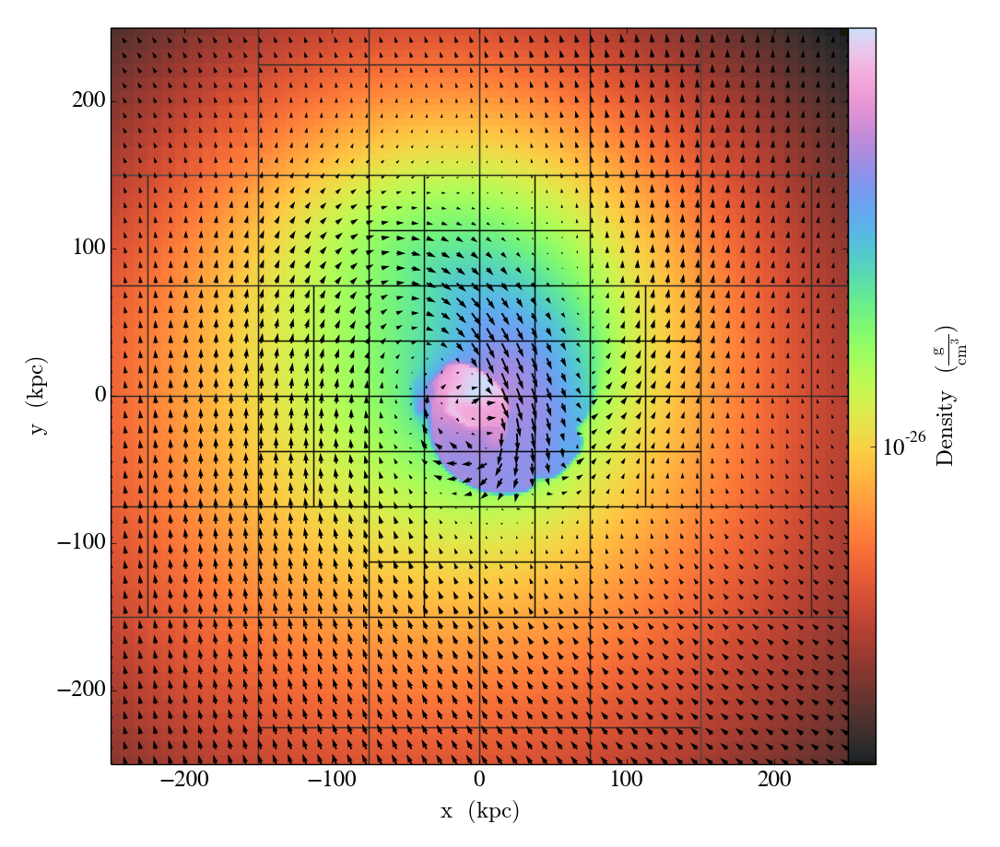

.. _plotting-and-images:

Plotting and Images
===================

.. _plots:

Plots
-----

``jt`` provides an interface to the most common plotting routines in ``yt``: ``SlicePlot``,
``ProjectionPlot``, ``ProfilePlot``, and ``PhasePlot``.

Unlike other methods in ``jt``, these return ``PyObject`` objects

.. code-block:: julia

    julia> slc = jt.SlicePlot(ds, "z", ["density","temperature"], width=(500.,"kpc"))

.. image:: ../images/slice_temperature.png

which produces a ``SlicePlot`` ``PyObject`` which has all the methods for annotating the plot
that one would have access to in ``yt`` available. For example, one can annotate grids:

.. code-block:: julia

    julia> slc.annotate_grids()

or velocity vectors:

.. code-block:: julia

    julia> slc.annotate_velocity()

Logging can be set for specific fields:

.. code-block:: julia

    julia> slc.set_log("temperature", false)

or the colormap can be changed:

.. code-block:: julia

    julia> slc.set_cmap("density", "kamae")

Similar options exist for the other plotting methods. The full set of options for these plots can
be found in the `yt Documentation <http://yt-project.org/docs/dev-3.0/visualizing/plots.html>`_.

.. _images:

Images
------

To create a raw 2D image from a ``Slice`` or ``Projection`` object,
one can create a ``FixedResolutionBuffer`` object using the ``to_frb`` method:

.. code-block:: julia

    julia> slc = jt.Slice(ds, "z", 0.0)
    YTSlice (sloshing_nomag2_hdf5_plt_cnt_0100): axis=2, coord=0.0

    julia> frb = jt.to_frb(slc, (500.,"kpc"), 800)
    FixedResolutionBuffer (800x800):
        -7.714193952405812e23 code_length <= x < 7.714193952405812e23 code_length
        -7.714193952405812e23 code_length <= y < 7.714193952405812e23 code_length

which can be plotted with a plotting package such as
`PyPlot <http://github.com/stevengj/PyPlot.jl>`_ or `Winston <http://github.com/nolta/Winston.jl>`_:

.. code-block:: julia

    julia> using Winston

    julia> imagesc(frb["kT"].value)

which yields the following image:

.. image:: ../images/winston.png