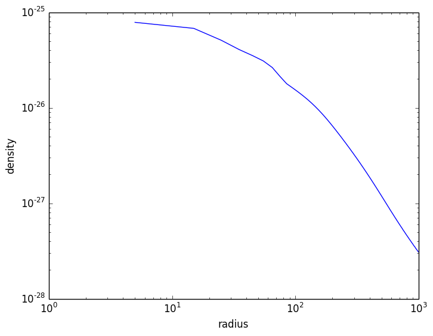

Profiles
========

``yt`` allows for data container objects to be binned up into profiles along some dimension defined
by a field. These can be in 1D, 2D, or 3D. ``YT`` reproduces this functionality via the
``YTProfile`` type:

.. code-block:: julia

   function YTProfile(data_source::DataContainer, bin_fields, fields;
                        n_bins=64, extrema=nothing, logs=nothing,
                        units=nothing, weight_field="cell_mass",
                        accumulation=false, fractional=false)

``YTProfile`` takes the following arguments:

  * ``data_source``: The ``DataContainer`` object containing the data from which the profile is
    to be created.
  * ``bin_fields``: An ``Array`` of field names over which the binning will occur. The number of
    fields decides whether or not this will be a 1D, 2D, or 3D profile. If a single field string is
    given, it assumed to be 1D.
  * ``fields``: A single field or list of fields to be binned.
  * ``n_bins``: A single integer or tuple of 2 or 3 integers, to determine the number of bins
    along each dimension.
  * ``extrema``: A dictionary of tuples (with the field names as the keys) that determine the
    maximum and minimum of the bin ranges, e.g. ["density"=>(1.0e-30, 1.0e-25)]. If a field's
    extrema are not specified, the extrema of the field in the ``data_source`` are assumed. The
    extrema are assumed to be in the units of the field in the ``units`` argument unless it is not
    specified, otherwise they are in the field's default units.
  * ``logs``: A dictionary of tuples (with the field names as the keys) that determine whether
    the bins are in logspace or linear space, e.g. ["radius"=>false]. If not set,
    the ``take_log`` attribute for the field determines this.
  * ``units``: A dictionary of tuples (with the field names as the keys) that determine the units
    of the field. If not set then the default units for the field are used.
  * ``weight_field``: The field to weight the binned fields by when binning. Can be a field name or
    ``nothing``, to produce an unweighted profile. ``"cell_mass"`` is the default.
  * ``accumulation``: If ``true``, the profile values for a bin n are the cumulative sum of all the
    values from bin 1 to n. If the profile is 2D or 3D, an ``Array`` of values can be given to
    control the summation in each dimension independently.
  * ``fractional``: If ``true``, the profile values are divided by the sum of all of the values.

For example, to construct a 1D radial profile from a ``Sphere``, with the bins in linear space
and with the units of the radius in kpc:

.. code-block:: jlcon

   julia> sp = YT.Sphere(ds, "max", (1.0,"Mpc"))

   julia> units=["radius"=>"kpc"]

   julia> logs=["radius"=>false]

   julia> fields=["density","temperature"]
   
   julia> profile = YT.YTProfile(sp, "radius", fields, n_bins=100, units=units, logs=logs)

The ``bin_fields`` can be accessed from the ``YTProfile`` object as attributes, e.g.:

.. code-block:: jlcon

   julia> profile.x
   100-element YTArray (kpc):
      4.99991
     14.9997
     24.9995
     34.9993
     44.9992
     54.999
     64.9988
     74.9986
     84.9984
     94.9982
     104.998
     114.998
     124.998
       ⋮
     884.983
     894.983
     904.983
     914.983
     924.983
     934.982
     944.982
     954.982
     964.982
     974.982
     984.981
     994.981

where the attributes ``x``, ``y``, and ``z`` correspond to the ``bin_fields`` of 1D, 2D,
and 3D profiles. The ``fields`` of the profile are accessed in the same way as ``DataContainer``\
s:

.. code-block:: jlcon

   julia> profile["temperature"]
   100-element YTArray (K):
    4.78287e7
    4.78144e7
    5.55494e7
    5.98079e7
    6.20128e7
    6.41538e7
    6.73181e7
    7.28897e7
    7.67484e7
    7.6859e7
    7.65575e7
    7.60974e7
    7.55863e7
    ⋮
    5.15882e7
    5.16148e7
    5.15205e7
    5.15374e7
    5.15363e7
    5.17031e7
    5.15198e7
    5.1652e7
    5.16727e7
    5.17993e7
    5.18381e7
    5.1944e7

The resulting profile data can be plotted with a plotting program like
`PyPlot <http://github.com/stevengj/PyPlot.jl>`_ or `Winston <http://github.com/nolta/Winston.jl>`_:

.. code-block:: jlcon

   julia> using PyPlot

   julia> plot(profile.x.value, profile["density"].value)

   julia> xscale("log")

   julia> yscale("log")

   julia> xlabel("radius")

   julia> ylabel("density")

The ``variance`` of a given field can be computed as well:

.. code-block:: jlcon

   julia> YT.variance(profile, "density")
   100-element YTArray (g/cm**3):
    8.88606e-27
    1.00439e-26
    1.05204e-26
    7.17655e-27
    7.2972e-27
    8.29273e-27
    7.97938e-27
    5.74176e-27
    3.73228e-27
    3.28493e-27
    2.91421e-27
    2.58537e-27
    2.27903e-27
    ⋮
    1.28528e-28
    1.28161e-28
    1.25986e-28
    1.25587e-28
    1.24444e-28
    1.24095e-28
    1.21943e-28
    1.21903e-28
    1.20435e-28
    1.20124e-28
    1.18991e-28
    1.18264e-28

The units of the ``bin_fields`` can be changed using one of the ``set_x_unit``, ``set_y_unit``,
or ``set_z_unit`` methods:

.. code-block:: jlcon

   julia> YT.set_x_unit(profile, "Mpc")

   julia> profile.x
   100-element YTArray (Mpc):
    0.00499991
    0.0149997
    0.0249995
    0.0349993
    0.0449992
    0.054999
    0.0649988
    0.0749986
    0.0849984
    0.0949982
    0.104998
    0.114998
    0.124998
    ⋮
    0.884983
    0.894983
    0.904983
    0.914983
    0.924983
    0.934982
    0.944982
    0.954982
    0.964982
    0.974982
    0.984981
    0.994981

Similarly, the units of the ``fields`` can be changed with ``set_field_unit``:

.. code-block:: jlcon

   julia> YT.set_field_unit(profile, "density", "Msun/kpc**3")

   julia> profile["density"]
   100-element YTArray (Msun/kpc**3):
    1.16056e6
    1.00365e6
    754309.0
    602161.0
    519959.0
    457351.0
    390482.0
    315199.0
    264284.0
    238734.0
    217263.0
    198420.0
    181572.0
    ⋮
    5663.04
    5563.15
    5426.81
    5324.81
    5220.5
    5140.14
    5011.73
    4930.84
    4834.15
    4757.82
    4663.7
    4584.25
